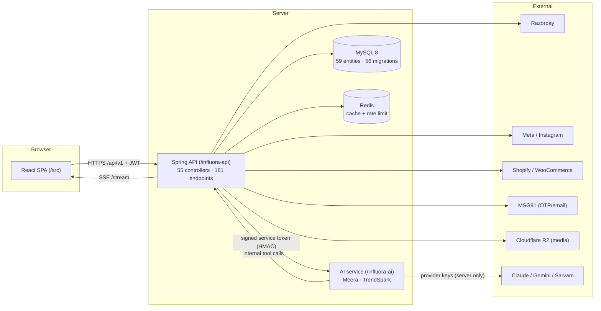
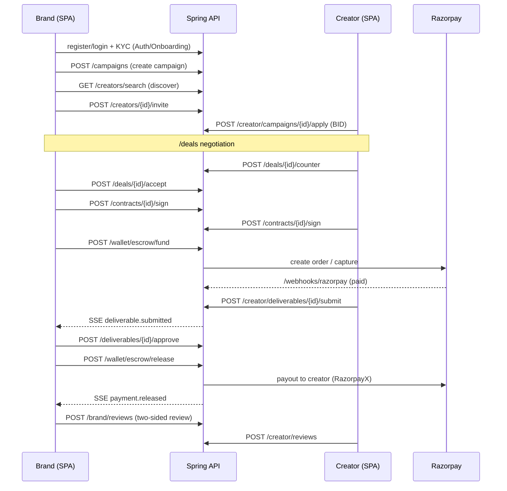
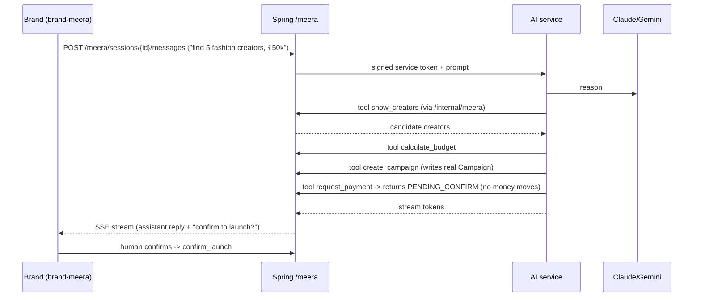

# Code Flowchart, Features & How Everything Connects

> Feature map + system flowcharts + a full worked example of one campaign end-to-end. Sourced from code.
> Lead: Priya. Diagrams render in any Mermaid-capable Markdown viewer (GitHub, VS Code, Obsidian).

---

## 1. System architecture

---

## 2. Feature map (domain → code)

| Feature | Frontend | Backend controller(s) | Entities |
|---|---|---|---|
| Auth + OTP | `*-login/register`, `*-onboarding` | `AuthController`, `OnboardingController` | `User`, `EmailOtpChallenge`, `RefreshToken` |
| Campaigns (+ Hype) | `brand-*-campaign*` | `CampaignController`, `CampaignTrackingController` | `Campaign`, `CampaignIntent` |
| Discovery + scoring | `brand-discover`, `creator-profile` | `CreatorController`, `AnalyticsController` | `CreatorProfile`, `CreatorScore`, `SavedCreator` |
| Deals / bidding | `*-deals`, `*-chat` | `DealController` | `Collaboration`, `DealMessage` |
| Contracts | `brand-contracts` | `ContractController` | `Contract` |
| Escrow + wallet | `*-wallet` | `WalletController`, `EscrowController` | `Wallet`, `EscrowHold`, `PaymentMilestone`, `Payout` |
| Deliverables | `*-campaign-detail` | `Brand/CreatorDeliverableController` | `Deliverable`, `DeliverableMetric` |
| Analytics | `*-analytics` | `CreatorAnalyticsController` | `CreatorMetric`, `AudienceDemographics`, `MediaMetric` |
| Affiliate + coupons | `creator-coupons/-affiliate-earnings` | `CreatorCoupon/AffiliateEarning`, `ConversionWebhook` | `CouponCode`, `CouponRedemption`, `AffiliateEarning`, `UtmCampaign` |
| Reviews | `*-reviews` | `Brand/CreatorReviewController` | `Review` |
| Disputes | `*-disputes` | `Brand/Creator/AdminDisputeController` | `Dispute` |
| Notifications | in-app + email | `NotificationController` + `EmailWorker` | `Notification`, `EmailOutbox` |
| AI (Meera) | `brand-meera` | `MeeraController`, `MeeraInternalController` | `AiConversation`, `AiMessage`, `MeeraToolCall`, `BrandAiCredit` |
| TrendSpark | `components/trendspark` | `TrendSparkController` | `Trend`, `SnapsbyCatalogVideo` |
| Store integrations | settings | Shopify/Woo connect + webhooks | `ShopifyIntegration`, `WooCommerceIntegration` |
| Admin | `src/admin/*` | 11 admin controllers | `AdminUser`, `ContentFlag`, `SupportTicket`, `AdminAuditLog` |

---

## 3. Core happy-path flow (brand hires creator)

---

## 4. AI-driven flow (brand runs a campaign by chatting with Meera)

Key guardrail: **the AI can never move money.** `request_payment` only ever returns `PENDING_CONFIRM`; a human `confirm_launch` is required (enforced in `MeeraInternalController`).

---

## 5. Worked example — "Nykaa runs a Diwali campaign"

1. **Onboard.** Nykaa (brand) registers, verifies email OTP (MSG91), completes company KYC. Admin verifies KYC (`/admin/brands/{id}/verify-kyc`).
2. **Fund wallet.** Adds ₹2,00,000 via Razorpay (`/wallet/topup` → `/webhooks/razorpay`).
3. **Create campaign.** "Diwali Glow — 10 reels" via `/campaigns` (or by chatting with Meera).
4. **Discover.** Searches fashion/beauty creators (`/creators/search`); scores come from `ScoreCalculationJob` off Meta metrics. Invites 8.
5. **Bid.** Creator @riya applies (`/creator/campaigns/{id}/apply`) proposing ₹18,000/reel. Nykaa counters ₹15,000 (`/deals/{id}/counter`); @riya accepts.
6. **Contract.** Both sign (`/contracts/{id}/sign`); PDF generated (OpenPDF), downloadable via `/contracts/{id}/pdf-download-url`.
7. **Escrow.** Nykaa funds ₹15,000 into escrow (`/wallet/escrow/fund`). Money is held, not paid.
8. **Deliver.** @riya posts the reel, submits it + metrics (`/creator/deliverables/{id}/submit`, `/mark-posted`). `DeliverableVerificationJob` checks it; Nykaa gets SSE `deliverable.submitted`.
9. **Approve + pay.** Nykaa approves (`/deliverables/{id}/approve`) → releases escrow (`/wallet/escrow/release`) → RazorpayX payout to @riya's bank minus `PLATFORM_FEE_PERCENT`.
10. **Affiliate bonus.** @riya's coupon `RIYA20` drives sales; `ConversionWebhookController` records redemptions → `AffiliateEarning`; `AffiliateSettlementJob` pays out.
11. **Review.** Both leave reviews (`/brand/reviews`, `/creator/reviews`).

Every step above maps to a real endpoint in `04-API-CONNECTION.md`.

---

## 6. Background jobs that keep it running (11 `@Scheduled`)

`ScoreCalculationJob`, `MetricsPollingJob`, `AudienceDemographicsJob`, `MetaTokenRefreshService`, `DeliverableVerificationJob`, `DeliverableCleanupJob`, `AffiliateEarningReconciliationJob`, `AffiliateSettlementJob`, `StaleTokenCleanupJob`, `EmailWorker`, plus the app scheduler. These compute creator scores, refresh Meta tokens, verify deliverables, reconcile affiliate money, and drain the email outbox.
