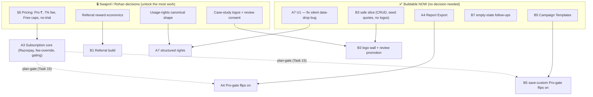

# 🗂️ INDEX — Remaining Build Workflow & Employee Loop

> **Owners:** Priya (CTO, architecture + final sign-off) · Arjun (Eng Lead, routing) · **Date:** 2026-07-14
> **Updated:** 2026-07-14 — **Swapnil (CEO) decision: A3 Subscription Billing going live.** D1 pricing signed off, A3 removed from open registry.
> **Purpose:** one place that connects every "not yet built" workflow doc, shows the shared loop, the dependency order, the decision gates, and **who does what**. Read this first, then open the per-initiative doc it points to.
> **Goal:** complete all open features. This index is the map; each linked `*-WORKFLOW.md` is the turn-by-turn.

---

## 1. How to use this index

1. Find the initiative in the **Registry (§3)** → open its linked doc for the full spec + task loop.
2. Every initiative runs the **same loop (§2)** — learn it once.
3. Anything marked **🔒 BLOCKED** is waiting on a decision in the **Swapnil Decision Queue (§5)** — clear those first, they unlock the most work.
4. Your daily work is on the **Employee Board (§6)**, organized by person.
5. Execution order is in **Waves (§7)** — don't start Wave 2 work while Wave 1 gates are open.

---

## 2. THE LOOP (every initiative follows this — company standard)

```
        ┌─────────────────────────────────────────────────────────┐
        │                    TASK_INBOX.md                         │
        └───────────────────────────┬─────────────────────────────┘
                                     ▼
                          Arjun routes the task
                                     ▼
                 Priya signs the SPEC  ── GATE ──┐  (once per initiative)
                                     │           │
        ┌────────────────────────────┘           │
        ▼                                         │
   Vikram (backend)  ‖  Ananya (frontend)   ◄──┐  │  ← run in PARALLEL after gate
        │                                      │  │
        ▼                                      │  │
   Kavya — QA review ──────────── fail ────────┘  │
        │ pass                                    │
        ▼                                         │
   Meera — local verify (mvn verify + tsc         │
        + Testcontainers + Playwright e2e) ─ fail ┘
        │ pass
        ▼
   Kabir — security audit  ── fail ──► back to owner
        │ pass   (REQUIRED only when money/PII/auth is touched)
        ▼
   Priya — final sign-off → merge → update status in REMAINING-FEATURES + this index
```

**Loop rules**
- **Nothing is "done" until Priya signs.** Any red (QA, build, security) routes straight back to the owning agent with the failure note.
- **Spec gate is mandatory** — no code before Priya signs the initiative's spec section.
- **Kabir gate fires only** when the change touches money, PII, or auth (flagged per initiative in §3).
- **Rohan validates economics** on anything with a price/fee/reward.
- Handoffs use the terse `FROM → TO | TASK | FILES | STATUS | NEXT` block in `SHARED_CONTEXT.md`.

---

## 3. Initiative registry (all open build docs)

| Gap | Initiative | Doc | Status | Kabir? | Blocked on |
|---|---|---|---|---|---|
| **B5** | Campaign Templates | `CAMPAIGN-TEMPLATES-WORKFLOW.md` | 🔴 0% (spec ready) | ➖ no | none — buildable now |
| **A4** | Report Export (CSV/PDF) | `A4-REPORT-EXPORT-WORKFLOW.md` | 🔴 0% (spec ready) | ➖ no | none — Pro-gate live with A3 |
| **A7** | Content Usage Rights | `A7-CONTENT-USAGE-RIGHTS-WORKFLOW.md` | 🔴 ~5% + **live bug** | ➖ no | shape decision (bug fix U1 is unblocked) |
| **B1** | Referral Program | `B1-REFERRAL-PROGRAM-WORKFLOW.md` | 🔴 0% | ✅ yes (money) | Rohan/Swapnil reward economics |
| **B3** | Social Proof / Case Studies | `B3-SOCIAL-PROOF-CASE-STUDIES-WORKFLOW.md` | 🔴 ~5% | ➖ no | Swapnil logo + review-consent |
| A6 | Notification prefs (push/SMS/digest) | archived | 🟢 ~50% | ➖ no | channel taxonomy decision |
| B4 | Lifecycle email (full digest) | archived | 🟢 ~30% | ➖ no | ESP build-vs-buy (Rohan) |
| B7 | Activation empty-states (follow-ups) | archived | 🟢 ~70% | ➖ no | none — 2 small FE follow-ups |

### ✅ Shipped (moved out of open registry)

| Gap | Initiative | Doc (archived) | Ship date |
|---|---|---|---|
| **A3** | Subscription Billing (Pro tier) | `SUBSCRIPTION-BILLING-PLAN.md` | 2026-07-14 |

**Status source of truth for shipped:** `REMAINING-FEATURES-2026-07-13.md` (archived). **Historical record:** `FEATURE_GAP_ANALYSIS.md` (superseded — do not act on its priority matrix).

---

## 4. Dependency & sequencing graph



**Read:** the four decisions on the left are the true critical path — each unlocks a whole initiative. Everything in **NOW** proceeds in parallel regardless.

---

## 5. Swapnil / Rohan decision queue (clear these to unblock work)

| # | Decision | Unblocks | Owner | Status |
|---|---|---|---|---|
| ~~D1~~ | ~~Pro price, 7% Pro fee, Free caps, no-trial~~ | ~~A3 core~~ | ~~Rohan → Swapnil~~ | ✅ **CLEARED 2026-07-14 — A3 going live** |
| D2 | Referral reward type/amount, qualifying event, fraud thresholds | **B1** | Rohan → Swapnil | 🔒 pending |
| D3 | Canonical usage-rights shape | **A7 structured** | Legal + Priya | 🔒 pending |
| D4 | Client logos policy + consent to promote private reviews | **B3 logo wall + review promotion** | Swapnil | 🔒 pending |

> **A7's data-drop bug (U1) is NOT gated** by D3 — it's a live legal-risk bug, fix it this week regardless.

---

## 6. Employee work board (who does what, across all initiatives)

| Person | Role | Open work (initiative · doc task) |
|---|---|---|
| **Priya** | CTO — spec gates + final sign-off | Sign every spec gate (A3 T10, B5 T21, A4 E1, A7 U2, B1 R1, B3 C1); final sign-off on all VERIFY loops |
| **Arjun** | Eng Lead — routing | Route each task from `TASK_INBOX`; keep `SHARED_CONTEXT.md` clean; sequence the Waves (§7) |
| **Vikram** | Backend | A3 T12–T16 (Razorpay/webhook/fee-override/gate/dunning) · B5 T22–T23 · A4 E2–E4 · **A7 U1 (do now) + U3/U5** · B1 R2–R5 · B3 C2–C3 |
| **Ananya** | Frontend | A3 T17–T18 · B5 T24–T25 · A4 E5 · A7 U4 · B1 R6 · B3 C4–C5 · **B7 2 follow-ups (now)** |
| **Kavya** | QA | Review every initiative before Meera (A3 T20, B5 T26, A4 E6, A7 U6, B1 R7, B3 C7) |
| **Meera** | DevOps / verify | `mvn verify` + `tsc` + Playwright e2e on every initiative; own the Flyway timestamp-migration convention |
| **Kabir** | Security | **Required gates:** A3 (billing) + B1 (reward payout fraud red-team). Advisory elsewhere |
| **Rohan** | CFO | Model D1 pricing + D2 reward economics + B4 ESP build-vs-buy; validate all fee/price math |
| **Tejas** | Growth/Market | B5 preset content, B1 growth mechanics, B3 case-study angle |
| **Nisha / Ishaan** | Content | A3 T18 pricing/FAQ copy · B3 C6 case-study writing |
| **Swapnil** | CEO | Decisions D1–D4 (§5) |

---

## 7. Recommended execution order (Waves)

**Wave 0 — do immediately, no dependencies (this week)**
- 🐛 **A7 U1** — fix the silent usage-rights data-drop (legal risk). *Vikram.*
- **B7 follow-ups** — creator-deals CTA + portfolio nudge. *Ananya.*
- **B3 safe slice** — CaseStudy table + admin CRUD + seed the 3 existing quotes (no logos, no review import). *Vikram + Ananya.*
- **Kick the decision queue (§5)** to Swapnil/Rohan in parallel — they gate Wave 2.

**Wave 1 — buildable now, parallel (no decision needed)**
- **B5 Campaign Templates** (Tasks 21–26) — full loop.
- **A4 Report Export** (E1–E6) — build mechanism; Pro-gate feature-flagged until billing Task 15.

**Wave 2 — unlocked by decisions**
- ~~**A3 Subscription core** (Tasks 12–20)~~ — ✅ **D1 cleared, A3 going live 2026-07-14.** Plan-gate (Task 15) now enables A4 + B5 Pro-gates.
- **B1 Referral** — the moment **D2** clears (Kabir fraud gate required).
- **A7 structured rights** (U2–U6) — the moment **D3** clears.
- **B3 logo wall + review promotion** — the moment **D4** clears.

**Wave 3 — polish / growth**
- **A6** push/SMS/digest real persistence (needs channel-taxonomy decision).
- **B4** full lifecycle digest (needs ESP build-vs-buy).

---

## 8. Definition of Done (for "all files complete")

An initiative's doc is **closed** only when ALL are true:
- [ ] Its VERIFY task passed the full loop (§2) and Priya signed.
- [ ] `mvn verify` green + `npx tsc --noEmit` clean + its Playwright e2e green.
- [ ] Kabir signed off (initiatives flagged ✅ in §3).
- [ ] Status flipped to ✅ in `REMAINING-FEATURES-2026-07-13.md` **and** in this index's §3.
- [ ] Any stale/mock code the initiative replaces is deleted (no dead scaffolds left).

**This index is complete when every row in §3 reads ✅.** Priya updates §3 on each sign-off; Arjun keeps the Waves (§7) and Employee Board (§6) current.

---

## 9. Linked docs (quick nav)

### Open build specs
`CAMPAIGN-TEMPLATES-WORKFLOW.md` · `A4-REPORT-EXPORT-WORKFLOW.md` · `A7-CONTENT-USAGE-RIGHTS-WORKFLOW.md` · `B1-REFERRAL-PROGRAM-WORKFLOW.md` · `B3-SOCIAL-PROOF-CASE-STUDIES-WORKFLOW.md`

### Shipped / archived (historical reference only)
`SUBSCRIPTION-BILLING-PLAN.md` (A3 shipped 2026-07-14) · `REMAINING-FEATURES-2026-07-13.md` (archived) · `FEATURE_GAP_ANALYSIS.md` (superseded)

### Standards the loop enforces
`KAVYA_QA_TEST_PLAN.md` · `KABIR_SECURITY_REQUIREMENTS.md` · `adr-flyway-migration-versioning.md` · `architecture.md` · `security.md`
