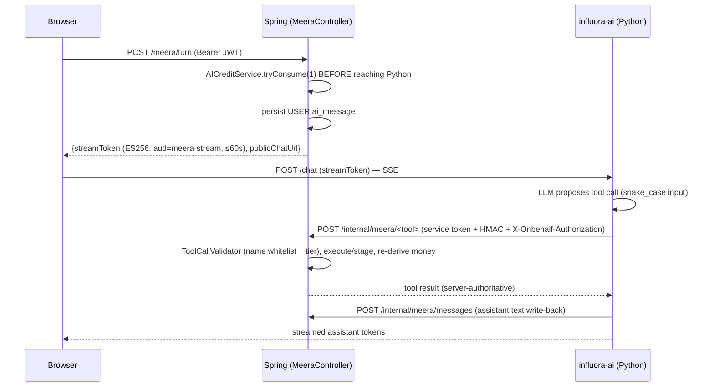

# AI

Influora has three AI surfaces, all backed by one external Python service ("**influora-ai**", FastAPI, hosting an LLM — Anthropic Claude per docs). **There is no LLM SDK in the Java code**; from Spring these are authenticated internal REST calls.

1. **Meera** — conversational campaign assistant for brands (streaming chat + tool calls).
2. **Brand-Safety** — GARM classification of creator content (feeds scoring).
3. **TrendSpark** — phrasing of trend nudges (never invents facts).

Governing invariant across all three: **"Meera proposes, Spring disposes, the human commits money."** Every guardrail is enforced Spring-side before the LLM is reachable.

---

## 1. Meera architecture

Two services, and Spring **never proxies the LLM stream**.



- **Browser → Python (SSE)**: `MeeraController.sendTurn` returns `{streamToken, publicChatUrl}`. The browser connects directly to Python's `/chat` (base `influora.meera.stream.public-chat-url`, default `http://localhost:8000/chat`). "Priya's locked architecture: no Spring proxy."
- **Stream token**: `StreamTokenService` mints an **ES256** JWT (`aud=meera-stream`, `kid` header, claims `jid` single-use, `sub`, `workspaceId`, `conversationId`, `messageId`). TTL is hard-capped at **60s** (`min(configured, 60)`), so a misconfigured env var can't widen the replay window. Python verifies via Spring's JWKS (`ALLOWED_ALGS = RS256, ES256` — never HS256).
- **Python → Spring**: the mesh gate (service token + HMAC + on-behalf JWT), documented in [authorization.md](authorization.md) §4.
- Note: `MeeraSessionService` currently persists a **placeholder** assistant echo; the real assistant text is streamed by Python and written back via `POST /internal/meera/messages`.

---

## 2. Tool-call model

Five tools, four tiers (`domain/enums/MeeraToolTier`, validated in `service/meera/tool/ToolCallValidator`):

| Tool | Tier | Route | On-behalf requirement | Behavior |
|---|---|---|---|---|
| `show_creators` | **R** (Read) | `/internal/meera/show_creators` | any member | Read-only creator search, max 10, public stats only (never touches `UserRepository`) |
| `calculate_budget` | **R** | `/calculate_budget` | any member | Pure computation, no repository dependency, advisory only |
| `create_campaign` | **D** (Draft) | `/create_campaign` | any member | Creates DRAFT campaign + `CampaignIntent`, **budget left null** (money not AI-writable) |
| `request_payment` | **C** (Commit) | `/request_payment` | OWNER/ADMIN | **Stages only** — returns `PENDING_CONFIRM` + a confirm URL; never debits |
| `confirm_launch` | **C** | `/confirm_launch` | OWNER/ADMIN | Go-live; requires **DB-verified FUNDED escrow**; charges publish fee transactionally |
| *(forbidden)* | **FORBIDDEN** | *no route exists* | — | bid-approval, payout config, code/config — structurally absent |

`ToolCallValidator.validateAndResolve(rawToolName, workspaceId)`: (1) unknown/hallucinated name → audit `UNKNOWN_TOOL_NAME` + throw; (2) tier null/FORBIDDEN → audit `FORBIDDEN_TIER` + throw. The controller additionally checks the resolved tool matches the invoked route (`TOOL_ROUTE_MISMATCH`).

### Money safety, traced

- **`CreateCampaignExecutor` (D)**: drafts `CampaignIntent(READY)` + `Campaign(DRAFT, title="Draft: <product>")` with `budgetMin/Max` **null**. The AI's `proposed_budget` is advisory. Idempotent via `IdempotencyService.executeOnce` + `meera_tool_calls` unique key.
- **`RequestPaymentExecutor` (C)**: server amount is always `AmountDerivationService.deriveForCampaignIntent(...)`; the AI's amount is used **only** for drift detection (>1% → 409 `AMOUNT_MISMATCH`, never silently corrected). Returns `PENDING_CONFIRM` + `confirmActionUrl`; the browser renders the human confirm button.
- **`ConfirmLaunchExecutor` (C)**: derives `campaignId` from `campaign_intent_id` (never trusts an AI-supplied id); requires ≥1 `EscrowHold` with status **FUNDED read fresh from DB** (else 409 `ESCROW_NOT_FUNDED`) — only a real Razorpay-webhook-driven FUNDED row unblocks launch. Then DRAFT→ACTIVE, `chargeOnPublish` **before** save (transactional; a fee failure rolls back so a campaign is never ACTIVE-unpaid), invites up to `creator_count` creators, binds funded holds, opens the 30-day unlimited-credit window.
- **`CalculateBudgetExecutor` (R)** & **`ShowCreatorsExecutor` (R)**: pure/read-only, cannot persist, expose only public aggregate stats.

### AI credits

`domain/entity/BrandAiCredit` (PK = workspace) + `service/meera/AICreditService`. `tryConsume(workspaceId, cost)` runs before any Python reachability:
1. **Daily cap first**: reset if the date rolled; `dailyActionsUsed >= 500` → 429 `DAILY_ACTION_LIMIT_EXCEEDED` even for unlimited tier (runaway-loop safety net).
2. If `unlimited_until` window active → no decrement.
3. Else atomic `tryDecrement` (`UPDATE ... WHERE credits_remaining >= cost`, never negative) → 0 rows → 402 `CREDITS_EXHAUSTED`.

Allotments: Free 100, first-funded-campaign bump to 150, Pro 400. `AICreditResetJob` (monthly, 02:00 UTC, 1st, BRAND workspaces only) applies the Pro allotment then resets. The `UsageCounter`/`UsageCounterDetail` mechanism is **separate** (subscription plan caps), not the Meera credit path.

Entities/migrations: `ai_conversations` (`UNIQUE(workspace_id, status)` → ≤1 ACTIVE), `ai_messages` (V12); `brand_ai_credits`, `meera_tool_calls` ledger (V14, `UNIQUE(idempotency_key)`, `server_amount`, `request_digest`); daily-cap columns (V16).

---

## 3. AI clients (`integration/ai`)

Both call the same influora-ai service over `java.net.http.HttpClient` + Jackson. **No retries** (single synchronous round-trip). Auth is an **ES256 service token** minted by `BrandSafetyServiceTokenService` (signed with Spring's EC private key; `iss=influora-api`, `aud=influora-internal`, `workspace_id`, `scope=service`, TTL ≤ 60s), verified by Python via JWKS.

### BrandSafetyAiClient — fail CLOSED
`POST {base}/internal/brand-safety`. **GARM** (Global Alliance for Responsible Media): 10 fixed categories, 4 risk levels, 3 sentiments (Python validates all 10 present). Rejects batches > 25 items before HTTP. Request carries `content_id, caption, media_type, posted_at`; response carries `garm_flags`, `content_sentiment`, `sentiment_score`, `brand_safety_score` (0–100). **Never logs captions.** Any failure/non-200/size-mismatch → `BrandSafetyAiException`; caller `BrandSafetyScoreService` catches → `Optional.empty()` → `ScoreCalculationJob` writes **NULL** brand-safety columns ("unscored", never "safe").

### TrendSparkAiClient — fail OPEN
`POST {base}/internal/trendspark/nudge` (same service-token mint). **Phrasing-only** — no price field by construction (price always from `SnapsbyCatalogVideo.priceInr`). Includes a hallucination kill-switch: any returned `video_id` not in the sent set is dropped. Every failure → `null` → caller `TrendSparkNudgeService.callAiSafely` uses a deterministic `templatedFallback` (`messageSource=FALLBACK`); the user never sees an error.

> **Config caveat**: `influora.brand-safety-ai`, `.trendspark-ai`, `.brand-safety-service-token`, `.jwks`, and `influora.meta` do **not** appear in any committed `application*.yml`. They fall back to hardcoded localhost defaults with empty secrets, and several eager beans (`SpringJwksKeyService`, `MetaTokenStorage`) throw at startup on blank keys — so a real deploy must inject those PEMs/keys out-of-band. See [environment.md](environment.md) and [known-limitations.md](known-limitations.md).

---

## 4. TrendSpark nudge engine

An anti-spam trend→campaign nudge. External **n8n** (`/trendspark/`) pulls Indian cultural/festival/sports trends daily (06:00 IST), tags each with a controlled **theme** vocabulary + a `campaign_type`, and writes `trends` rows (Java is read-only for `trends`). On brand-dashboard load, `GET /brand/trendspark/nudge`:

```mermaid
flowchart TB
  A[GET /brand/trendspark/nudge] --> B[pick active trend by theme overlap]
  B --> C{score >= threshold(2)?}
  C -- no --> Z[204 No Content — stay silent]
  C -- yes --> D[ContentGapService: OWN_CONTENT vs SNAPSBY]
  D --> E[optional CatalogMatchService top-3 videos]
  E --> F[callAiSafely → AI copy or templatedFallback]
  F --> G[write nudge_log, return card 200]
```

Services (`service/trendspark/`): `ThemeMatchService` (overlap count against a locked JSON vocabulary), `ContentGapService` (gap decision → mode), `BrandOwnContentService` (real gap signal via Instagram insights, else `last_posted_at` proxy), `CatalogMatchService` (top-3 catalog videos), `TrendSparkNudgeService` (assembly + `NudgeLog`). Threshold 2, gap 4 days (`TrendSparkProperties`). Callbacks: `POST .../nudge/{id}/click`, `.../purchase`. Below threshold / no trend / no profile → **204, silence is correct**. See [features/trendspark.md](features/trendspark.md).

---

## Prompt / model summary

- **Model**: an LLM (Anthropic Claude per docs) hosted behind influora-ai; not called from Java.
- **Prompt flow**: user turn → Spring charges a credit → browser streams from Python → LLM emits tool calls → Spring validates/executes/re-derives → results stream back.
- **Storage**: conversations/messages in `ai_conversations`/`ai_messages`; tool calls in `meera_tool_calls` (with `request_digest`, `server_amount`, result ref).
- **Retries/fallback**: none in the AI clients; brand-safety fails closed (NULL scores), trendspark fails open (templated copy). Meera credit checks and idempotency guard the tool path.
- **Failure handling**: tool-name and tier violations are audited and rejected 403; money mismatches 409; escrow-not-funded 409; credits exhausted 402; daily cap 429.
