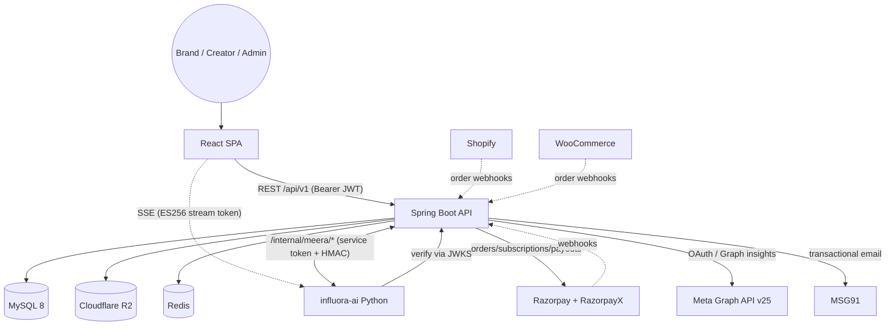
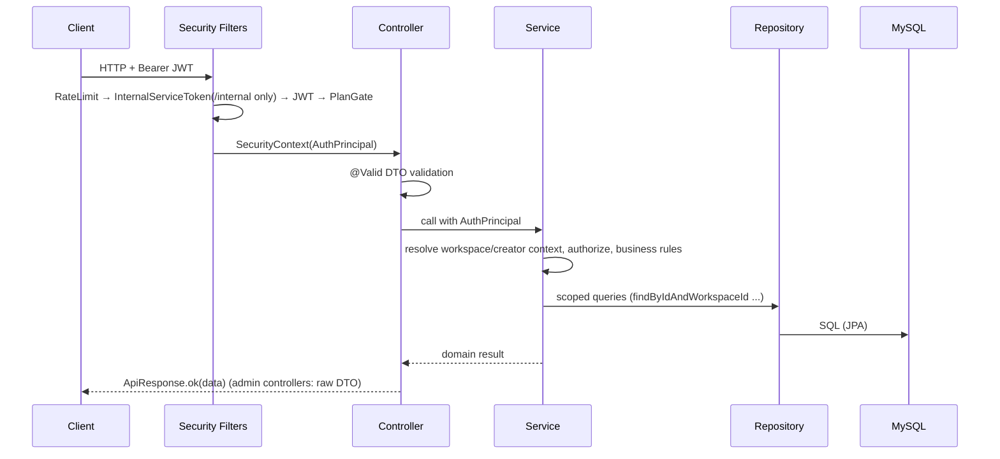
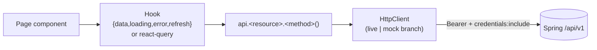
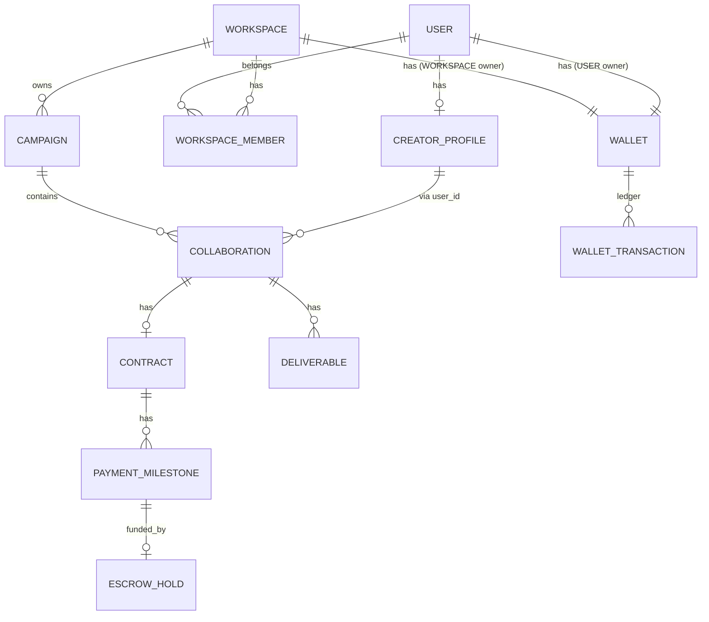
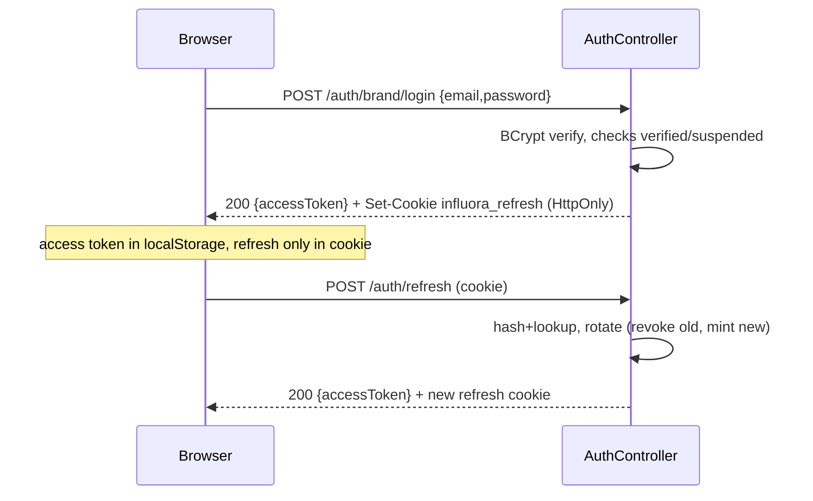
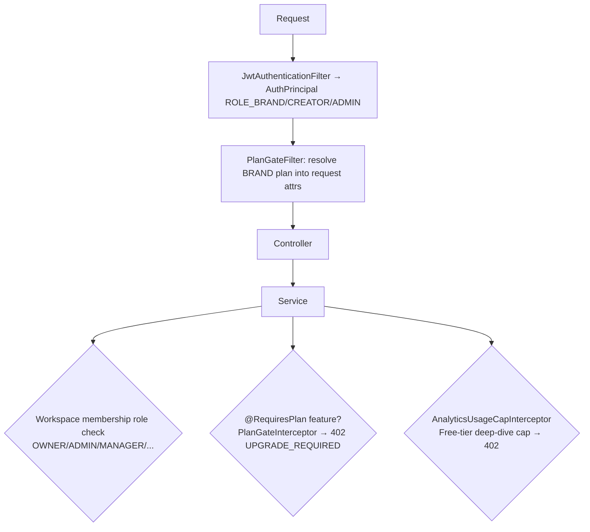
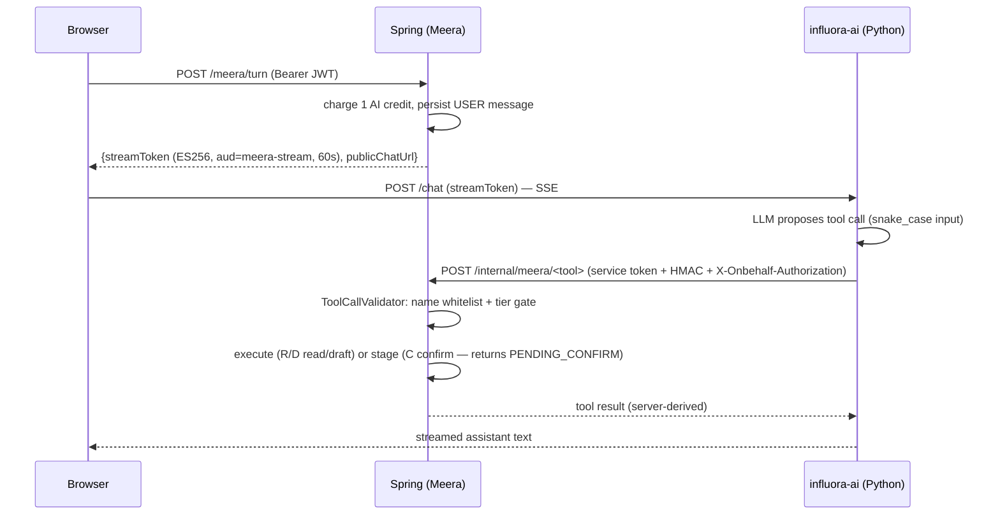
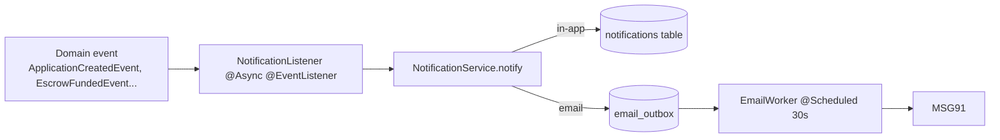
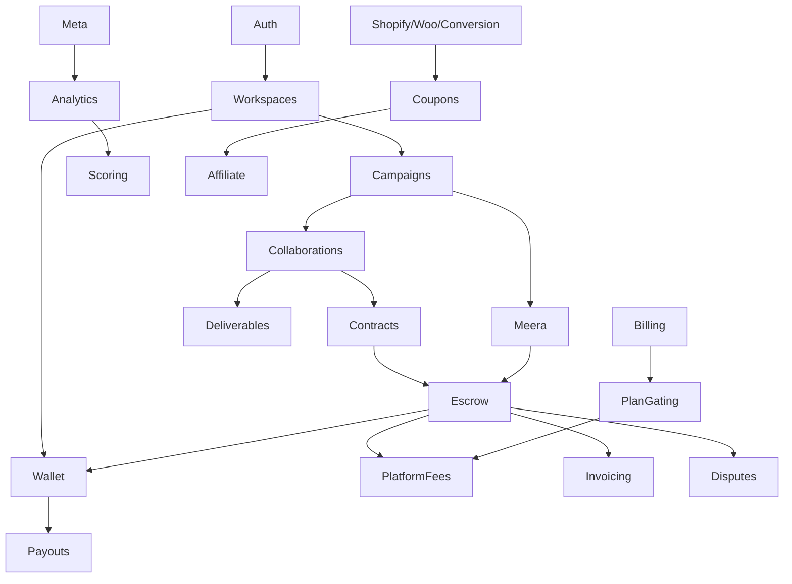

# Architecture

This document describes how Influora is put together: the system topology, the backend and frontend layering, the data model shape, and the auth / AI / payment / notification flows. Diagrams are Mermaid.

---

## 1. System architecture

Influora is a **three-tier system with a detached AI service**:

- **Client tier** — a React/Vite single-page app, served as static files by nginx.
- **Application tier** — a Spring Boot monolith (`influora-api`) exposing REST under `/api/v1`.
- **Data tier** — MySQL 8 (system of record), Redis (present; limited runtime use today), Cloudflare R2 (object storage for media & PDFs).
- **AI tier** — a separate Python "influora-ai" (FastAPI) service that hosts the LLM and three internal endpoints.



**Key architectural decisions (from code):**

- The LLM stream is **never proxied** by Spring. Spring mints a 60-second ES256 stream token; the browser connects to Python directly. This keeps Spring stateless and out of the token-streaming path.
- The Python→Spring callback surface (`/internal/meera/*`) is triple-guarded: a service JWT, an HMAC request signature (with nonce + timestamp replay protection), and a re-validated on-behalf human JWT.
- **All money is derived server-side.** No money amount is ever trusted from a request body (documented "Guardrail-1"); the single exception (brand wallet top-up amount) is reconciled against the Razorpay webhook.
- MySQL is the single source of truth; balances are a denormalized projection kept in lockstep with an append-only ledger inside the same transaction.

---

## 2. Backend architecture

The backend is a **layered Spring Boot monolith**, package root `com.influora`. Context path is `/api/v1` (`server.servlet.context-path`).

```
com.influora
├── web/            @RestController + web/dto/*   (HTTP boundary, request/response DTOs)
├── service/        @Service business logic (admin, analytics, billing, meera, notification,
│                    payout, portfolio, scoring, tracking, trendspark, verification, ...)
├── repository/     Spring Data JPA repositories + JPA Specifications
├── domain/
│   ├── entity/     @Entity JPA classes (~70 entities)
│   └── enums/      domain enums (~90 enums)
├── security/       filters, JWT, cookies, TOTP, plan gating, service-mesh auth
├── integration/    external clients (ai, meta, razorpay, shopify, woocommerce, storage, msg91, tracking)
├── job/            @Scheduled background jobs
├── config/         @Configuration + @ConfigurationProperties
└── common/         cross-cutting utilities (ApiResponse, PasswordPolicy, TextSanitizer, ...)
```

### Request lifecycle



**Conventions** (see [backend.md](backend.md) and [coding-guidelines.md](coding-guidelines.md)):

- Controllers are thin; authorization lives in the **service layer** (not in `SecurityConfig` `hasRole()` rules). Path-param ids are never trusted — access is via `BrandContextService.requireBrandWorkspace` / `CreatorContextService.requireCreatorProfile`.
- Responses use an `ApiResponse.ok(data, meta?)` envelope, **except admin controllers** which return raw DTOs (a documented inconsistency).
- Cross-tenant lookups return a generic `NOT_FOUND` (no enumeration oracle).
- Money and other critical operations use `IdempotencyService.executeOnce` + DB unique constraints (insert-first-wins).
- Primary keys are 26-char ULIDs.

### Cross-cutting services

`IdempotencyService`, `WalletLedgerService` (sole ledger writer), `BrandContextService`/`CreatorContextService` (tenant resolution), `TextSanitizer`, `MalwareScanService`, `AuditLogService`, `NotificationService` (event-driven).

---

## 3. Frontend architecture

A **client-rendered SPA**. Entry `src/main.tsx` → `App.tsx` wraps everything in one `QueryClientProvider` → `BrowserRouter` → route table. There is no root Auth/Theme provider; sessions are read from `localStorage` tokens and theming is injected via a hook.



Three route areas each with a guard: **Brand** (`ProtectedRoute` + `BrandLayout`), **Creator** (`CreatorProtectedRoute`, pages self-wrap `CreatorLayout`), **Admin** (`AdminProtectedRoute` → a nested admin router). Guards check only token *presence* in `localStorage`; the server is the real authority.

State: **Zustand** for local UI/domain stores (`src/lib/store.ts`), **TanStack Query** used sparingly (billing, some admin, TrendSpark). The API layer (`src/lib/api.ts`) is a single `HttpClient` with per-resource objects and a mock/live switch (`VITE_API_MODE`). See [frontend.md](frontend.md).

The admin console (`src/admin/*`) is effectively a **self-contained mini-app** with its own API client (`/api/v1/admin`, `admin_token`), types, RBAC matrix, and a native-WebSocket realtime layer.

---

## 4. Data architecture

- **MySQL 8 / InnoDB / utf8mb4.** ~70 tables, all ULID (`VARCHAR(26)`) PKs.
- **Flyway** manages schema. ~74 migrations, mixing numeric (`V1`–`V64`) and timestamp (`V20260709...`) versions; `out-of-order: true` because timestamp versions sort below the numeric ones.
- **Money**: `BigDecimal` stored as `DECIMAL(14,2)` (some `12,2`) in **rupees**; the one exception is subscription `invoices.amount` in **paise** (`INT`). Paise only appears at the Razorpay boundary.
- **Ledger**: `wallet_transactions` is append-only; each posting is a DEBIT+CREDIT pair sharing a `group_id`, with a per-leg `idempotency_key` unique constraint as the true serialization point. Balances live on `wallets` and are updated in the same transaction.
- **Time-series** (immutable snapshots, one row per poll/run): `creator_metrics`, `media_metrics`, `audience_demographics`, `creator_scores`.



Full table catalogue in [database.md](database.md).

---

## 5. Authentication flow

Two coexisting token schemes (this is the single most important auth fact):

| Token | Algorithm | Key | Purpose |
|---|---|---|---|
| User access token | **HS256** (symmetric) | `influora.jwt.access-secret` | Brand/creator/admin API auth (`Authorization: Bearer`) |
| Stream / service token | **ES256** (asymmetric EC) | JWKS EC keypair | Spring→Python (Meera SSE, brand-safety, trendspark) |
| Internal service token (Python→Spring) | **HS256** | `internal-service-token.signing-secret` | `/internal/meera/*` gate |
| Refresh token | opaque random | SHA-256 hashed at rest | Session durability (HttpOnly cookie) |

The public JWKS endpoint (`GET /.well-known/jwks.json`) publishes **only** the EC public key for service/stream tokens — user access tokens are HMAC, not published.



Admins additionally have TOTP MFA (encrypted secret, lockouts). See [authentication.md](authentication.md).

---

## 6. Authorization flow



Roles come from `UserType`; plan entitlements from `Subscription`/`Plan`; workspace-level permissions from `WorkspaceMember.role`. The service-mesh (Python) auth is a separate dual-credential gate. See [authorization.md](authorization.md).

---

## 7. AI flow (Meera)



Five tools, four tiers: **R**ead (`show_creators`, `calculate_budget`), **D**raft (`create_campaign` — leaves budget null), **C**ommit (`request_payment` stages only; `confirm_launch` requires DB-verified funded escrow), **Forbidden** (no route exists). Governing rule: *"Meera proposes, Spring disposes, the human commits money."* See [ai.md](ai.md).

---

## 8. Payment / escrow flow

```mermaid
sequenceDiagram
  participant Br as Brand
  participant API as Spring
  participant RZP as Razorpay
  participant Cr as Creator
  Br->>API: POST /wallet/topup (Idempotency-Key)
  API->>RZP: create order
  RZP-->>API: webhook order.paid (HMAC verified)
  API->>API: ledger: clearing → brand wallet (DEPOSIT)
  Br->>API: POST /wallet/escrow/fund (campaign/milestone)
  API->>RZP: create order → webhook → ledger brand → clearing (ESCROW_HOLD)
  Note over API: campaign publish also debits brand fee → revenue
  Br->>API: POST /wallet/escrow/release (milestone)
  API->>API: fee = gross*bps/10000 → clearing→revenue; net → creator wallet
  Cr->>API: POST /wallet/withdraw → clearing (queues RazorpayX payout)
```

Every posting flows through `WalletLedgerService.post(...)` (the sole ledger writer), which locks both wallets in id order, verifies currency & balance, and is idempotent via a per-leg unique key. See [features/wallet.md](features/wallet.md), [features/escrow.md](features/escrow.md), [features/payouts.md](features/payouts.md).

---

## 9. Notification flow



In-app delivery is **HTTP poll only** (no notification WebSocket/SSE; the only SSE is Meera). Email goes through an idempotent outbox with retry/backoff. See [features/notifications.md](features/notifications.md).

---

## 10. Background jobs (scheduling)

`@EnableScheduling` in `InfluoraApiApplication`. All cron in UTC; each job has an `AtomicBoolean` overlap guard.

| Job | Schedule | Purpose |
|---|---|---|
| `MetricsPollingJob` | every 6h | pull creator profile metrics from Meta |
| `DeliverableVerificationJob` | every 6h at :30 | verify posted deliverables via Instagram insights |
| `AudienceDemographicsJob` | Sun 03:30 | pull audience demographics |
| `ScoreCalculationJob` | daily 04:00 | compute creator scores |
| `MetaTokenRefreshService` | daily 02:30 | refresh Meta tokens near expiry |
| `StaleTokenCleanupJob` | daily 04:00 | soft-revoke long-expired Meta tokens |
| `DeliverableCleanupJob` | daily 02:00 / 02:30 | R2 cleanup (dry-run default) |
| `SubscriptionDunningJob` | daily 03:00 | PAST_DUE → HALTED after grace |
| `SubscriptionRenewalResetJob` | daily 03:30 | period advance / allotment reset |
| `AICreditResetJob` | monthly 02:00, 1st | reset brand AI credits |
| `AffiliateSettlementJob` | monthly 05:00, 1st | batch-settle affiliate earnings |
| `AffiliateEarningReconciliationJob` | hourly :15 | backfill missing affiliate earnings |
| `EmailWorker` | every 30s (fixedDelay) | send queued emails |

See [performance.md](performance.md).

---

## 11. Dependency graph (module coupling)



Auth/Workspaces are foundational; the money core (Wallet/Escrow) is the hub that Contracts, Fees, Invoicing, Payouts and Disputes all depend on. Analytics depends on the Meta integration; Meera depends on the campaign + escrow flows.
