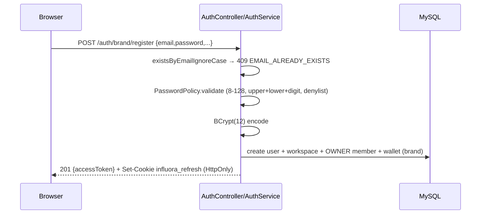

# Authentication

How Influora proves who is calling. Covers the token model, login/registration, email OTP, refresh rotation, admin MFA, and the frontend session handling.

Backend: `security/` + `web/AuthController.java`, `web/AdminAuthController.java`, `service/AuthService.java`, `service/admin/AdminAuthService.java`. Frontend: `src/lib/api.ts`, `src/lib/auth-session.ts`, `src/App.tsx`.

---

## The token model (most important section)

There are **two independent JWT signing schemes**, and one opaque token type:

| Token | Algorithm | Key | Where it's used |
|---|---|---|---|
| **User access token** | **HS256** (symmetric HMAC) | `influora.jwt.access-secret` | Brand/creator/admin API auth (`Authorization: Bearer`) |
| **Stream / service token** | **ES256** (asymmetric EC P-256) | JWKS EC keypair (`influora.jwks.*`) | Spring→Python (Meera SSE, brand-safety, trendspark) |
| **Internal service token** | **HS256** | `internal-service-token.signing-secret` | Python→Spring `/internal/meera/*` |
| **Refresh token** | opaque random (`UUID.UUID`) | SHA-256 hashed at rest | Session durability (HttpOnly cookie only) |

**Critical fact:** `GET /.well-known/jwks.json` publishes **only** the EC public key used for service/stream tokens. User access tokens are HMAC-signed with a symmetric secret and are **not** in the JWKS. (`JwtService.java`, `SpringJwksKeyService.java`, `JwksController.java`.)

### Access token contents

`JwtService.createAccessToken(userId, userType, email, workspaceId)` produces an HS256 JWT with claims: `jti` (random UUID), `sub` (userId), `userType`, `email`, optional `workspaceId`, `iat`, `exp`. Default expiry **900s** (`JWT_ACCESS_EXPIRY`). No `kid`, no rotation for user tokens. Admin role/MFA state is deliberately **not** in the JWT — it is re-read from `admin_users` on each privileged call.

### Refresh token

`createRefreshTokenValue()` = `UUID + "." + UUID` (opaque, high-entropy, not a JWT). Stored as a **SHA-256 hash** in `refresh_tokens` / `admin_refresh_tokens`, with `expires_at` (default **2,592,000s = 30 days**) and `revoked`. The raw value lives only in an HttpOnly cookie.

---

## Login & registration flow

`web/AuthController.java` (`/auth`) delegates to `service/AuthService.java`.

- **Register** (`brand`/`creator`): duplicate check (409), `PasswordPolicy` (`common/PasswordPolicy.java`: 8–128 chars, requires upper+lower+digit, rejects `common-passwords.txt` denylist → `WEAK_PASSWORD`), BCrypt cost 12. Brand register also creates the workspace, an OWNER `WorkspaceMember`, and a wallet; creator register creates the profile + wallet. Wrapped in a try/catch that translates a `DataIntegrityViolationException` to 409 (TOCTOU-safe). If `influora.auth.require-email-otp-before-register` (default **false**) is on, a verified OTP challenge is required first.
- **Login**: `WRONG_USER_TYPE` guard, BCrypt `matches` → `INVALID_CREDENTIALS`, suspended/deactivated → `ACCOUNT_SUSPENDED`, and if `require-email-verification` (default **true**) with status `PENDING_VERIFICATION` and `!emailVerified` → 403 `EMAIL_NOT_VERIFIED`. On success, `issueTokens` returns an access token and sets the refresh cookie. The refresh token is stripped from the JSON body (`TokenPair.withoutRefresh()`).

### Refresh rotation & revocation

`AuthService.refresh`: hash the presented raw token → `findByTokenHashAndRevokedFalse` filtered on `expiresAt > now` (else 401 `INVALID_REFRESH_TOKEN`). **Rotation**: revoke the old row, mint a new raw token, save it, issue a fresh access token; the controller sets the new cookie. This is **single-use** but there is **no reuse-detection / token-family revocation** — replaying a burned token simply 401s (no breach alert). `logout` and password reset both call `revokeAllForUser(userId)`.

### Cookies

`AuthCookieService` / `AdminAuthCookieService`:
- User: name `influora_refresh` (`AUTH_REFRESH_COOKIE_NAME`), `HttpOnly; Secure; SameSite=Strict`, path `/api/v1/auth`, maxAge = refresh expiry.
- Admin: name `influora_admin_refresh`, path `/api/v1/admin/auth` (deliberately distinct so admin and user sessions can't be confused).
- `secure` defaults to `false` in base config; `SecretsStartupValidator` forces it `true` outside dev or aborts boot.

---

## Email OTP

`service/BrandEmailOtpService.java` + `email_otp_challenges` (V5), shared by brand and creator. `MAX_ATTEMPTS=3`, `OTP_TTL=300s`, send limit ~3/email/hour. OTP is generated with `SecureRandom` and stored **hashed** (`JwtService.hashToken`). **Anti-enumeration**: the send response is identical whether or not the email is registered; a registered email consumes quota but receives no OTP. Verify: expired → 410, ≥3 attempts → 429, mismatch → 400 `INVALID_OTP`. OTP delivery is **email-only** via MSG91 (dev logs the OTP). There is **no SMS**.

---

## Admin MFA (TOTP)

`web/AdminAuthController.java` (`/admin/auth`) + `service/admin/AdminAuthService.java` + `security/TotpService.java`.

- **TOTP**: hand-rolled RFC 6238 (HMAC-SHA1, 6 digits, 30s step, ±1 step drift, 160-bit Base32 secret). No QR image is rendered server-side (no QR lib approved) — setup returns the `otpauth://` URI + plaintext secret once; the SPA draws the QR.
- **Secret at rest**: AES-256-GCM encrypted (`AdminMfaSecretCipher`, 12-byte random IV prepended, key must decode to exactly 32 bytes).
- **Enrollment**: `mfa/setup` stages ciphertext (not yet enabled); `mfa/verify` decrypts + verifies → confirms.
- **Login challenge**: password lockout (5 attempts / 900s), then if MFA enabled a separate MFA lockout (3 / 3600s); missing code → 401 `MFA_REQUIRED`; if `mfa-enforce-on-login` (default true) and role ∈ {SUPER_ADMIN, ADMIN} without enrollment → 403 `MFA_ENROLLMENT_REQUIRED` (SUPPORT exempt).

> **Recovery caveat**: there is no in-app endpoint to enroll/repair a locked-out admin — recovery is a direct DB update. See [known-limitations.md](known-limitations.md).

---

## Security filters involved

Runtime order (all `addFilterBefore(UsernamePasswordAuthenticationFilter)`):

1. `AuthRateLimitFilter` — per-instance fixed-window limits (login/register/reset 10/60s, OTP 5, refresh 30, plus per-user write buckets, creator-withdraw 5/hour). Emits `X-RateLimit-*`, 429 on breach. Decodes percent-encoding to prevent path-encoding bypass.
2. `InternalServiceTokenFilter` — guards `/internal/**` only.
3. `JwtAuthenticationFilter` — parses Bearer → `AuthPrincipal` (authority `ROLE_<userType>`, carries `workspaceId`). On `JwtException` clears context and continues (401/403 comes from authorize rules, not the filter).
4. `PlanGateFilter` — resolves the BRAND plan (see [authorization.md](authorization.md)).

---

## Frontend session handling

- **Access token in `localStorage`** (`brand_token` / `creator_token` / `admin_token`) — attached as `Authorization: Bearer` per role. This is an acknowledged XSS exposure (any XSS steals a live token); the HttpOnly refresh cookie limits durability, not immediate theft. API CSP is the documented secondary mitigation.
- `credentials: 'include'` on every call carries the refresh cookie, but **no 401→refresh→retry interceptor exists** — the cookie is sent but the frontend never calls `/auth/refresh`, so brand/creator sessions currently break on access-token expiry rather than refreshing. (`src/lib/api.ts`.)
- `src/lib/auth-session.ts` persists the access token + user metadata; the refresh token is deliberately never persisted to JS.
- Guards (`ProtectedRoute` etc.) check token *presence* only.
- The admin client (`src/admin/services/api-contracts.ts`) uses `admin_token`, does **not** set `credentials:'include'`, and its `refreshToken()` is dead code.

---

## Config properties

`influora.jwt.{access-secret, refresh-secret, access-expiry-seconds=900, refresh-expiry-seconds=2592000}`; `influora.auth.{require-email-verification=true, require-email-otp-before-register=false, otp-length=6, refresh-cookie.*, rate-limit.*}`. See [environment.md](environment.md).

---

## Known risks (summary)

Access tokens in localStorage; no refresh-token reuse detection; frontend refresh half-wired; `require-email-otp-before-register` defaults off; refresh-cookie `secure` defaults off (guarded outside dev); committed dev-default secrets (safe only because `SecretsStartupValidator` fails closed in non-dev); admin lockout has no in-app recovery; rate limiting is per-instance (needs Redis at scale). Full detail in [security.md](security.md) and [known-limitations.md](known-limitations.md).
