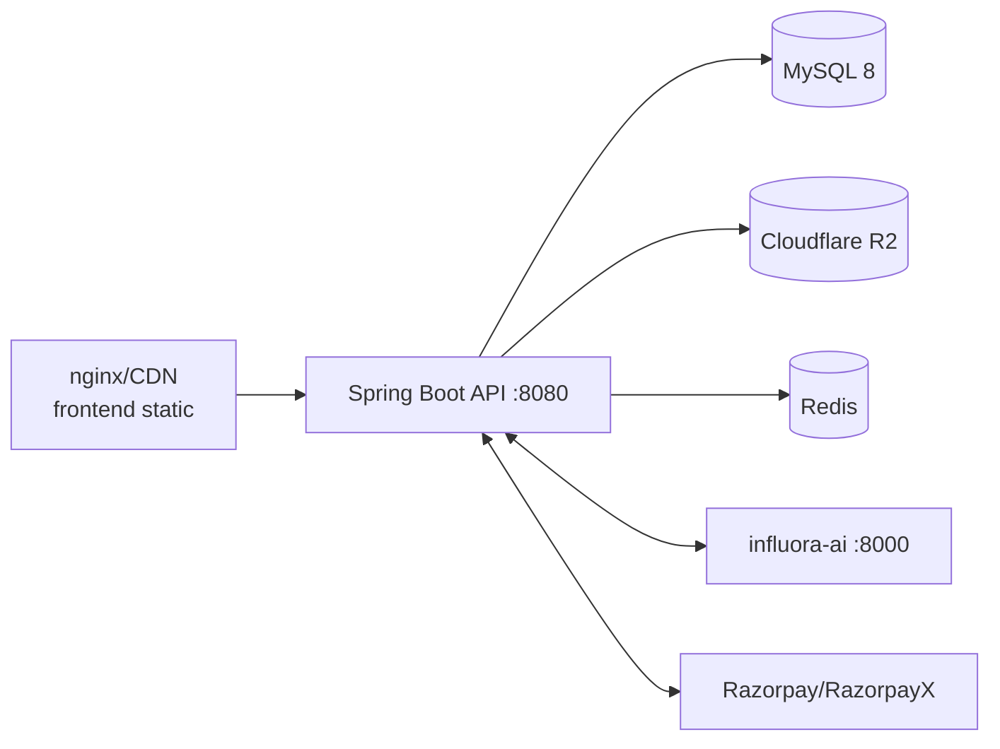

# Deployment

How Influora is built, containerized, and shipped. There are three deployable services (frontend SPA, Spring Boot API, Python AI) plus MySQL/Redis/R2 as managed dependencies.

---

## Services & images

| Service | Build | Runtime | Notes |
|---|---|---|---|
| Frontend | `Dockerfile` (multi-stage: `node:20-alpine` → `nginx:1.27-alpine`) | nginx on port 80 | Static `dist/` bundle |
| Backend | Spring Boot jar (Maven) | JVM, port 8080, context `/api/v1` | `influora-api/` |
| AI | Python/FastAPI (separate repo "influora-ai") | port 8000 | Hosts the LLM |
| MySQL | `mysql:8.0` (`docker-compose.yml` for local) | 3306 | utf8mb4, Flyway migrates on API start |
| Redis | external | 6379 | present; limited runtime use |
| R2 | Cloudflare | — | object storage |

### Frontend Dockerfile (important build-time detail)

Vite **inlines every `VITE_*` var at build time**, not at container-run time. Setting `VITE_API_BASE_URL` as a `docker run -e` var does nothing — by then the bundle is static. Staging/prod values must be passed as `--build-arg` at `docker build`:

```
docker build \
  --build-arg VITE_API_MODE=live \
  --build-arg VITE_API_BASE_URL=https://api.influora.com/api/v1 \
  --build-arg VITE_MEERA_STREAM_URL=https://ai.influora.internal \
  -t influora-frontend .
```

nginx serves `/usr/share/nginx/html` with `docker/nginx.conf` (SPA fallback). A `HEALTHCHECK` hits `/`.

A **build-time guard** in `vite.config.ts` fails `vite build` if a production build isn't `VITE_API_MODE=live` with a non-localhost API URL — so a misconfigured prod bundle can't ship in mock mode (it would otherwise throw `MockAuthDisabledError` on first login). `.env.production` pins these defaults.

---

## Spring profiles & Flyway

- **`dev`** (`application-dev.yml`): email verification off, DEBUG logging, points at local MySQL (`docker compose up -d mysql`).
- **`prod`** (`application-prod.yml`): `flyway.baseline-on-migrate: false` — prod must apply every migration from a deliberately-established baseline, never auto-baseline (auto-baseline could silently skip migrations on a real DB).
- Base `application.yml`: `flyway.out-of-order: true` (timestamp versions V20260709… sort below numeric V41–V64, so strict ordering would skip them), `ddl-auto: validate` (Hibernate never mutates schema).
- `SecretsStartupValidator` (gated on `APP_ENV`, default `dev`) aborts boot in non-dev if required secrets are missing/weak/duplicated. See [environment.md](environment.md).

Migrations run automatically on API startup. For prod, establish the Flyway baseline deliberately before the first deploy.

---

## CI (GitHub Actions, `.github/workflows/`)

| Workflow | Purpose |
|---|---|
| `backend-ci.yml` | Build/compile backend |
| `backend-tests.yml` | JUnit + Testcontainers |
| `ai-tests.yml` | AI-related tests |
| `frontend-checks.yml` | Lint/typecheck/build (`npm ci`) |
| `flyway-validate.yml` | Validate migration ordering/integrity |
| `schema-check.yml` | Entity↔schema consistency |
| `lighthouse-meera.yml` | Lighthouse perf budget (`ci/lighthouse-meera.mjs`, puppeteer-core) |

CI installs against `package-lock.json` (`npm ci`) — that is the canonical lockfile the Dockerfile also follows, even though a `pnpm-lock.yaml` exists.

---

## Local development

```bash
# 1. Database
docker compose up -d mysql            # MySQL 8 on :3306 (db=influora, user/pass=influora)

# 2. Backend (from influora-api/)
./mvnw spring-boot:run -Dspring-boot.run.profiles=dev   # :8080, context /api/v1

# 3. AI service (separate repo)  → :8000

# 4. Frontend (repo root)
cp .env.local.example .env.local      # VITE_API_MODE=live, VITE_API_BASE_URL=http://localhost:8080/api/v1
npm ci && npm run dev                 # Vite :3000, proxies /api/v1 → :8080
```

See [developer-onboarding.md](developer-onboarding.md) for the request-flow walkthrough.

---

## Production topology (recommended, from build artifacts)



- Frontend and API are separate containers; the frontend calls the API by absolute URL (baked at build).
- The Python AI service must be reachable from Spring (internal REST) and from the browser (SSE) — hence both `influora.meera.stream.public-chat-url` (browser-facing) and the internal client base URL.
- Secrets are injected as environment variables (never in the image); refresh-cookie `secure` must be true; JWKS EC keys and all HMAC/JWT secrets must be provisioned or the API refuses to start.

---

## Release checklist (derived)

1. Provision all backend secrets (JWT/stream/internal/HMAC, JWKS PEMs, admin MFA key, Razorpay, R2, MSG91, Meta, DB) — startup validates them.
2. Establish the Flyway baseline on the prod DB, deploy the API (migrations apply).
3. Build the frontend with the correct `VITE_*` build-args and deploy behind nginx/CDN.
4. Deploy/point at the influora-ai service; set `VITE_MEERA_STREAM_URL` and the internal base URL.
5. Configure Razorpay/Shopify/Meta webhook endpoints and secrets.
6. Confirm `/health` and a smoke login.
