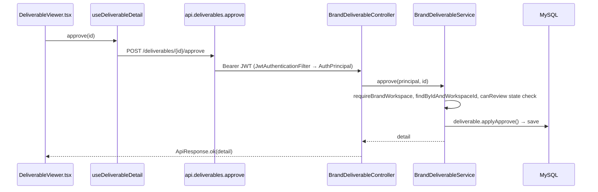

# Developer Onboarding

A guide for a new engineer: how the project works, how a request flows end-to-end, how features are organized, and where to add new things.

---

## 1. Get it running

```bash
# Database
docker compose up -d mysql          # MySQL 8 on :3306 (db=influora, user/pass=influora)

# Backend (influora-api/)
./mvnw spring-boot:run -Dspring-boot.run.profiles=dev   # :8080, context /api/v1
#   dev profile: email verification off, DEBUG logging, dev-default secrets accepted

# AI service (separate repo "influora-ai")  → :8000  (needed for Meera/scoring; optional otherwise)

# Frontend (repo root)
cp .env.local.example .env.local    # VITE_API_MODE=live, base URL localhost:8080/api/v1
npm ci
npm run dev                         # Vite on :3000, proxies /api/v1 → :8080
```

Notes:
- In `dev`, `SecretsStartupValidator` accepts dev-default secrets. In any other environment, all secrets must be provisioned or the API won't boot ([environment.md](environment.md)).
- Set `VITE_API_MODE=mock` to run the frontend against built-in mock data without a backend (many surfaces already default to mock).
- Flyway migrates the DB automatically on backend start.

Verify: `GET http://localhost:8080/api/v1/health` returns healthy; register a brand at `/brand/register`.

---

## 2. How the project works (mental model)

Influora is a **React SPA + Spring Boot monolith + external Python AI service**, backed by MySQL, Cloudflare R2, and payment/analytics providers. Brands run escrow-backed campaigns; creators deliver content and get paid; admins arbitrate. Read [project-overview.md](project-overview.md) and [architecture.md](architecture.md) first.

Three actor areas, each with its own frontend routes, tokens, and layouts: **brand**, **creator**, **admin**. Plus the AI (Meera) and external service callers.

---

## 3. How a request flows

Example: a brand approves a deliverable.



The same shape recurs everywhere: **UI → hook → api resource → controller → (filters) → service (tenant + rules) → repository → entity transition → DB → response**. See [architecture.md](architecture.md) §2.

---

## 4. How features are organized

- **Backend**: each feature spans `web/<X>Controller`, `web/dto/<x>/`, `service/<X>Service` (sometimes in a sub-package), `domain/entity/<X>`, `domain/enums/`, a Flyway migration, and possibly an `integration/`, `job/`, or `security/` piece.
- **Frontend**: a feature spans `pages/<area>-<x>`, `components/<area>/<x>/`, `hooks/<area>/use<X>`, and an `api.<x>` resource in `lib/api.ts`.
- Each feature has a doc in `features/` that lists exactly these files (the "Connected Files" and "Execution Flow" sections).

Start from the feature doc for whatever you're changing (e.g. [features/escrow.md](features/escrow.md)).

---

## 5. Where to add things

### A new API endpoint
1. Add a method to the relevant `<X>Controller` (or create one under `web/`), taking `@AuthenticationPrincipal AuthPrincipal`.
2. Add request/response DTOs under `web/dto/<x>/` with validation annotations.
3. Implement the logic in `<X>Service`: resolve tenant context, authorize, apply rules, use idempotency for money.
4. Add the endpoint to `src/lib/api.ts` (a method on the resource object, mock+live branches) and consume it via a hook.
5. Document it in [api.md](api.md) and the feature doc.

### A new page
1. Create `src/pages/<area>-<name>.tsx` (kebab-case). Brand pages usually re-export a `components/brand/*` feature component.
2. Wire the route in `src/App.tsx` under the correct guard/layout.
3. Add a hook + `api` resource for its data.

### A new feature
Combine the above: entity + migration + service + controller + DTOs on the backend; page + components + hook + api resource on the frontend. Add a `features/<name>.md` following the existing template. Update [README.md](README.md)'s feature list and [database.md](database.md)/[api.md](api.md).

### A new database table
1. Add a Flyway `V<next>.sql` (never edit an applied one). Mind `out-of-order`.
2. Add the `@Entity` + repository; keep entity and DDL in sync (`ddl-auto: validate`).
3. Update [database.md](database.md).

### A new AI (Meera) tool
1. Add the tool to `MeeraToolName` and its tier to `ToolCallValidator.TIER_BY_TOOL`.
2. Add an executor under `service/meera/tool/` and a route on `MeeraInternalController`.
3. For R/D tools, execute read/draft logic; for C tools, **stage only** and require human confirmation — never write money. Follow the money-safety patterns in [ai.md](ai.md).

### A new notification
1. Define an event implementing `NotificationEvent` (sealed interface) and publish it from the relevant service.
2. Add an `@Async @EventListener` handler in `NotificationListener` routing to `NotificationService.notify(...)`.
3. Add the email template in MSG91 and route the event (in-app / email / both).

---

## 6. Conventions to internalize

Read [coding-guidelines.md](coding-guidelines.md). The load-bearing ones: money is server-derived and ledgered through `WalletLedgerService` with idempotency; tenancy is enforced in services with scoped finders; entities own their state transitions; the frontend flows page→hook→api→HttpClient; and the codebase is deliberately honest about gaps.

---

## 7. Before you assume a feature works

Several flows are intentionally stubbed or half-wired (subscription webhooks, real payouts, synchronous affiliate accrual, some mock frontend surfaces, unrunnable frontend tests). **Read [known-limitations.md](known-limitations.md) before extending any money or AI flow** — it will save you from "fixing" something that was never wired.

---

## 8. Useful references

- API surface: [api.md](api.md) · Schema: [database.md](database.md) · Auth: [authentication.md](authentication.md)/[authorization.md](authorization.md) · AI: [ai.md](ai.md) · Config: [environment.md](environment.md) · Deploy: [deployment.md](deployment.md).
- The Java tests (Testcontainers) are authoritative examples for backend behavior.
