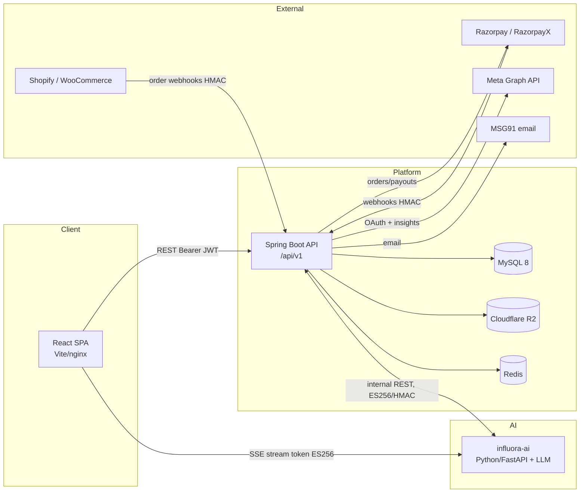

# Project Overview

## Business objective

Influora is a two-sided **influencer-marketing marketplace** targeting the Indian creator economy. It exists to make brand↔creator collaborations trustworthy and end-to-end managed inside one platform, with **escrow-backed payments** as the trust anchor: a brand's money is held by the platform and only released to the creator when contractual milestones are met, with disputes arbitrated by platform admins.

The commercial model has three revenue levers, all implemented in code:

1. **Brand publish fee** — charged when a campaign goes live (7% for Pro subscribers, 10% otherwise, on the campaign's max budget).
2. **Creator commission** — 15% deducted from each escrow release before the creator is paid.
3. **SaaS subscription** — a Pro plan (₹4,999/mo) that lifts usage caps, unlocks exports/templates, and lowers the brand fee.

All money is in **INR**, and invoicing is **GST-compliant** (CGST/SGST/IGST split, HSN/SAC codes, fiscal-year invoice numbering) because the platform operates under Indian tax law.

## Who uses it

| Actor | Description |
|---|---|
| **Brand** | A company (workspace) that runs campaigns, funds escrow, and hires creators. Workspace-scoped with member roles (OWNER/ADMIN/MANAGER/MEMBER/VIEWER). |
| **Creator** | An influencer who applies to / is invited to campaigns, delivers content, and withdraws earnings. Has a public portfolio. |
| **Admin** | Platform operator (SUPER_ADMIN / ADMIN / SUPPORT) who verifies KYC, moderates content, resolves disputes, and manages fees/billing. MFA-protected. |
| **Meera (AI)** | Conversational assistant for brands. Proposes actions; never commits money. |
| **Service actors** | Razorpay/RazorpayX, Meta (Instagram), Shopify, WooCommerce, MSG91, the influora-ai Python service. |

## Main modules

- **Identity & auth** — registration, email OTP, JWT sessions, admin MFA/TOTP, workspaces & members.
- **Marketplace** — creator discovery/search, scoring, featured creators, save/shortlist.
- **Campaigns** — campaign CRUD, campaign types (HYPE/DIRECT/REVIEW/STANDARD), templates, tracking links.
- **Deals** — collaboration lifecycle (invite/apply/negotiate), deal-room chat, contracts + milestones.
- **Deliverables** — content upload → brand review → post → platform verification.
- **Money** — double-entry wallet ledger, escrow, payouts (RazorpayX), platform fees, subscriptions/billing, GST invoicing, affiliate earnings & coupons.
- **Analytics** — Meta-pulled creator metrics, computed scores (fake-follower/quality/rate), audience demographics, deliverable metrics, exports.
- **AI** — Meera conversational campaign creation (tool-calling), Brand-Safety GARM scoring, TrendSpark trend nudges.
- **Integrations** — Meta OAuth + insights, Shopify/WooCommerce/generic conversion webhooks, UTM tracking.
- **Notifications** — in-app + email (MSG91) via an outbox worker.
- **Admin console** — a self-contained operations mini-app (KYC, moderation, disputes, support, finance, billing).

## Technology stack

**Backend** — Java 21, Spring Boot 3.3.5. Starters: Web, Data JPA, Data Redis, Security, Validation, Actuator. JJWT 0.12.6 (JWTs), Flyway (schema migrations), MySQL Connector/J, AWS SDK v2 `s3` (Cloudflare R2), `ulid-creator` (26-char ULID primary keys), `razorpay-java` 1.4.6, OpenPDF 1.3.30 (invoice/contract PDFs), Testcontainers (integration tests).

**Frontend** — React 19 + Vite 6 (client-side SPA, **not** Next.js despite a dead `src/app/` scaffold). React Router v7, TanStack Query 5 (used sparingly), Zustand 5, Radix UI + hand-maintained shadcn primitives, Tailwind v4, framer-motion (UI motion), three.js + @react-three/fiber + drei (3D scenes), GSAP + Lenis (marketing scroll only), Recharts (charts), react-hook-form + zod (forms), sonner (toasts).

**AI service** — a separate Python (FastAPI) service, "influora-ai", reachable from Spring over authenticated internal REST. It hosts the LLM (Anthropic Claude, per docs) behind three endpoints: Meera chat (browser connects directly via SSE), Brand-Safety GARM classification, and TrendSpark nudge phrasing. There is **no LLM SDK in the Java code**.

**Infrastructure** — MySQL 8, Redis, Cloudflare R2, Razorpay/RazorpayX, MSG91, Meta Graph API v25.0.

See [environment.md](environment.md) and [external-services.md](external-services.md) for exact versions and config.

## High-level architecture



The SPA talks to Spring over REST (Bearer JWT). For AI chat, the SPA connects **directly** to the Python service using a short-lived ES256 stream token minted by Spring — Spring never proxies the LLM stream. The Python service calls back into Spring's `/internal/meera/*` endpoints (protected by a service token + HMAC request signing) to execute validated tool calls.

## Folder structure (top level)

```
/                         repo root (Vite frontend project)
├── src/                  React SPA source (pages, components, hooks, lib, admin, content)
├── influora-api/         Spring Boot backend (Maven, com.influora)
│   └── src/main/
│       ├── java/com/influora/  config, domain, repository, security, service, web, integration, job, common
│       └── resources/db/migration/  Flyway V*.sql
├── trendspark/           n8n workflow + theme taxonomy for the trend pipeline (ops, not React)
├── public/, styles/      static assets
├── e2e/, test-results/   Playwright (config present)
├── ci/                   lighthouse-meera.mjs
├── docker/, Dockerfile, docker-compose.yml
└── .github/workflows/    CI pipelines
```

See [folder-structure.md](folder-structure.md) for the full breakdown.

## Development & deployment workflow

- **Local dev**: `docker compose up -d mysql` for the database; Spring Boot runs with the `dev` profile (email verification off, DEBUG logging); the frontend runs `npm run dev` (Vite dev server on port 3000, proxying `/api/v1` → `localhost:8080`). The AI service runs separately on `localhost:8000`.
- **Build**: frontend `vite build` produces a static `dist/` bundle (all `VITE_*` vars inlined at build time), served by nginx. Backend builds a Spring Boot jar. Both are Dockerized.
- **CI** (GitHub Actions): `backend-ci`, `backend-tests`, `ai-tests`, `frontend-checks`, `flyway-validate`, `schema-check`, `lighthouse-meera`.
- **DB migrations**: Flyway. Dev auto-baselines; **prod does not** (`application-prod.yml` sets `baseline-on-migrate: false`). Migrations run in version order with `out-of-order: true` (because later timestamp-named migrations sort below numeric V41–V64).

See [deployment.md](deployment.md).

## Environment variables (highlights)

Backend secrets (must be injected outside `dev`, or startup aborts via `SecretsStartupValidator`): `JWT_ACCESS_SECRET`, `JWT_REFRESH_SECRET`, `MEERA_STREAM_SIGNING_SECRET`, `INTERNAL_SERVICE_TOKEN_SECRET`, `INTERNAL_REQUEST_HMAC_SECRET`, JWKS EC key PEMs, admin MFA encryption key, `RAZORPAY_*`, `R2_*`, `MSG91_*`, `META_*`, DB credentials.

Frontend (public, inlined at build): `VITE_API_MODE` (must be `live` for prod), `VITE_API_BASE_URL`, `VITE_MEERA_STREAM_URL`. See [environment.md](environment.md) for the complete list.

## Project lifecycle / maturity

The platform is feature-broad and largely implemented, with a mature money core (double-entry ledger, idempotency, webhook HMAC verification, GST invoicing). Several flows are intentionally stubbed or partially wired and are documented as such: subscription webhooks are not routed, real RazorpayX payouts pass a placeholder fund-account id, affiliate earnings accrue via an hourly backfill rather than synchronously, and some frontend surfaces still run on mock data. See [known-limitations.md](known-limitations.md) for the consolidated list. Treat that file as required reading before extending any money or AI flow.
