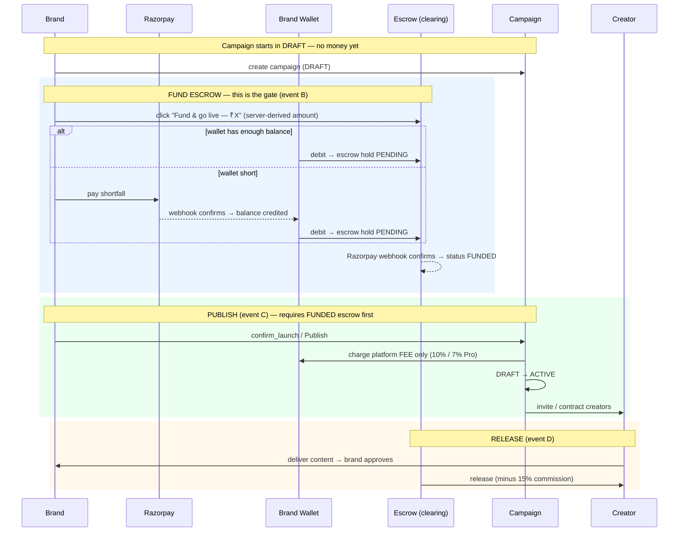
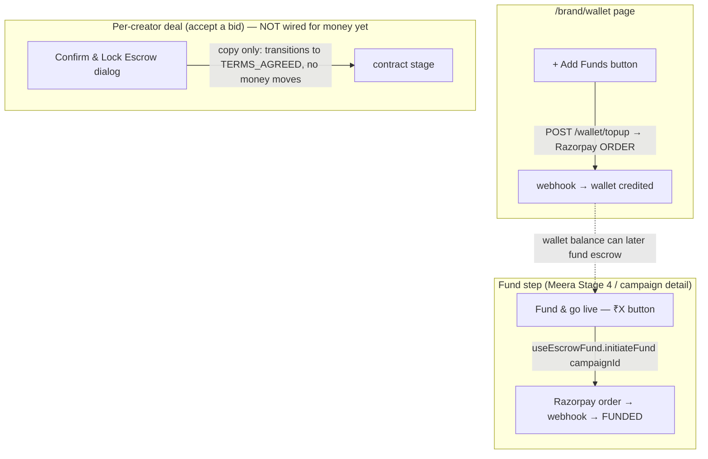

# Campaign Funding & Money Flow

> Where the brand's money enters, where Razorpay appears in the UI, and the two
> funding models that currently coexist in the code. Traced from real call sites
> (see file:line refs). Money-safety invariant throughout: **the brand's money is
> only ever moved by a human click on a server-derived amount — Meera can surface
> the button, never submit it.**

---

## 1. The two money moments (they are NOT the same event)

A brand pays in two structurally separate places. Conflating them is the usual
confusion:

| # | Event | UI control | Where | Money movement | Amount source |
|---|---|---|---|---|---|
| A | **Wallet top-up** | `+ Add Funds` | `/brand/wallet` (`src/pages/brand-wallet.tsx`) | Razorpay → **brand wallet** (available balance) | brand types it |
| B | **Fund escrow** | `Fund & go live — ₹X` | Meera Stage 4 (`StageFunding.tsx` → `FundEscrowButton.tsx`) **or** campaign detail | brand wallet (or Razorpay) → **escrow clearing** | **server-derived**, brand cannot edit |
| C | **Publish / go live** | `Publish` / `confirm_launch` | campaign detail / Meera | brand wallet → **revenue** (platform **fee only**, 10% / 7% Pro) | server-derived |
| D | **Release** | on deliverable approval | timeline | escrow clearing → **creator wallet** (minus 15% commission) | server-derived |

Key point: **Publish (C) does NOT fund escrow — it only charges the platform
fee.** Escrow must already be FUNDED (B) before a campaign can go live.

---

## 2. Current end-to-end sequence

**The launch gate:** `ConfirmLaunchExecutor` reads a DB-verified `FUNDED` escrow
hold before it will flip the campaign ACTIVE (`ConfirmLaunchExecutor.java:256`) —
only a real Razorpay-webhook-confirmed FUNDED row unblocks launch. A campaign
can never go live unfunded.

---

## 3. Where does Razorpay actually open?

Razorpay is invoked at **two** buttons today: `+ Add Funds` (generic wallet) and
`Fund & go live` (per-campaign escrow). There is also a **third, per-creator**
money-lock at `Confirm & Lock Escrow` when a brand accepts a specific bid
(`brand-campaign-detail.tsx:1724`) — see §5.

> ⚠️ **KNOWN GAP (product-truth):** the actual Razorpay **checkout popup is not
> wired yet.** The backend mints Razorpay *orders* correctly, but the frontend
> has no `window.Razorpay(...).open()` launcher — `FundEscrowButton.tsx:124`
> simulates success in mock mode, and `brand-wallet.tsx:353` notes the same. Any
> funding-model decision below must include "wire the real Razorpay checkout
> launcher" as a line item.

---

## 4. Meera / AI boundary

- Meera's `request_payment` (commit-tier) can only **surface** the pre-filled
  `FundEscrowButton` — it cannot submit it (`FundEscrowButton.tsx:4-11`, "human
  click required, never auto-called").
- No amount in the request body — the button sends `campaignId` only and the
  server re-derives the amount (`FundEscrowButton.tsx:9`).
- Meera never sees the wallet balance (Kabir/Priya ruling — balances are on
  `_FORBIDDEN_BRAND_FIELDS`). Affordability, if needed, comes back as a coarse
  `can_fund` / `needs_topup` signal on the executor **result**, never the rupee
  figure in the prompt. See `SHARED_CONTEXT.md` → "Kabir — Wallet-Balance-in-AI".

---

## 5. One money engine, two possible granularities (Priya, corrected)

There is **ONE** money engine, not two live paths:
`EscrowService.initiateFund` → Razorpay webhook → `confirmFunded`, with the amount
keyed **either** per-campaign (`budgetMax`) **or** per-milestone, chosen by
`deriveFundAmount` (`EscrowService.java:204`).

> **Correction:** the `Confirm & Lock Escrow` copy on the accept-bid dialog
> (`brand-campaign-detail.tsx:1699-1724`) is **aspirational UI — no money moves
> there today.** `handleAccept` (`:629`) → `DealService.doAccept`
> (`DealService.java:452`) only `transitionTo(TERMS_AGREED)`. So there is no live
> "per-creator lock at accept-bid" money path yet; it would have to be built.

So the real question is not "reconcile two engines" but **"at what granularity and
at what moment do we trigger the one engine"** — upfront per-campaign pool, or
per-creator/per-milestone at hire. That is the decision on the table.

---

## 6. DECISION OF RECORD (Swapnil, 2026-07-21)

> Status: **DECIDED** — upfront funding for ALL campaign types; build Option 1 only.

**Model: upfront escrow funding stays for every campaign type** (HYPE, DIRECT,
REVIEW, awareness). A campaign is funded into escrow BEFORE it can go ACTIVE — the
`confirm_launch` FUNDED gate is unchanged. Rationale: strongest creator-trust
guarantee everywhere (money fully secured before any creator works), one model,
lowest risk. The brand commits the full campaign budget before hiring.

**✅ BUILD — Option 1: inline Razorpay at the fund step.** A brand who just signed
up starts a campaign directly and never needs to detour to `/brand/wallet`. At the
fund step, if the wallet balance is short, Razorpay opens right there, takes the
payment, credits the wallet, then funds escrow — all in one button. Low-risk UX
merge of events A+B; money model unchanged; amount stays server-derived; human
click still required. **This also delivers the missing Razorpay checkout launcher
(§3 gap) — the prerequisite for real payments.**

**❌ REJECTED — Option 2: pay-only-at-hire (per-creator).** Would let a campaign go
ACTIVE with zero escrow and move money per-hire afterward. Rejected because it
weakens the up-front creator-trust guarantee, conflicts with the `confirm_launch`
FUNDED gate, and does not fit the Hype bulk-upfront model. Not built.

Full analysis: `SHARED_CONTEXT.md` → "Priya — Funding-Model Options Ruling".
